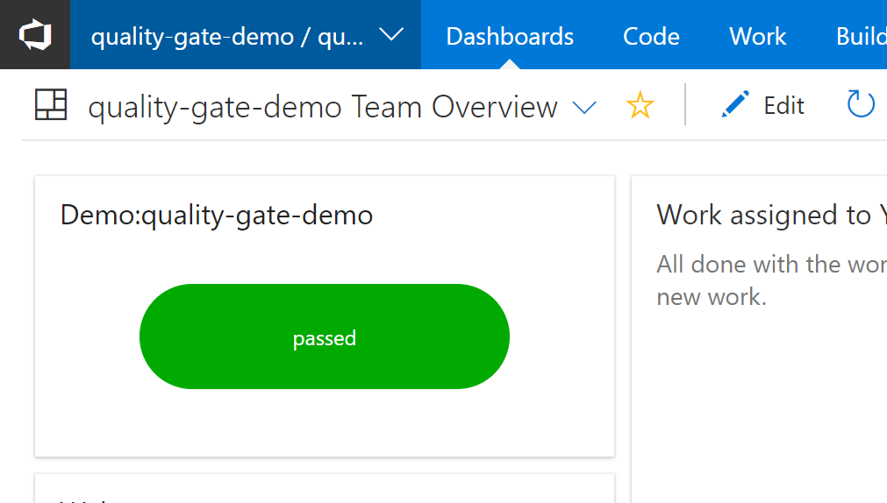
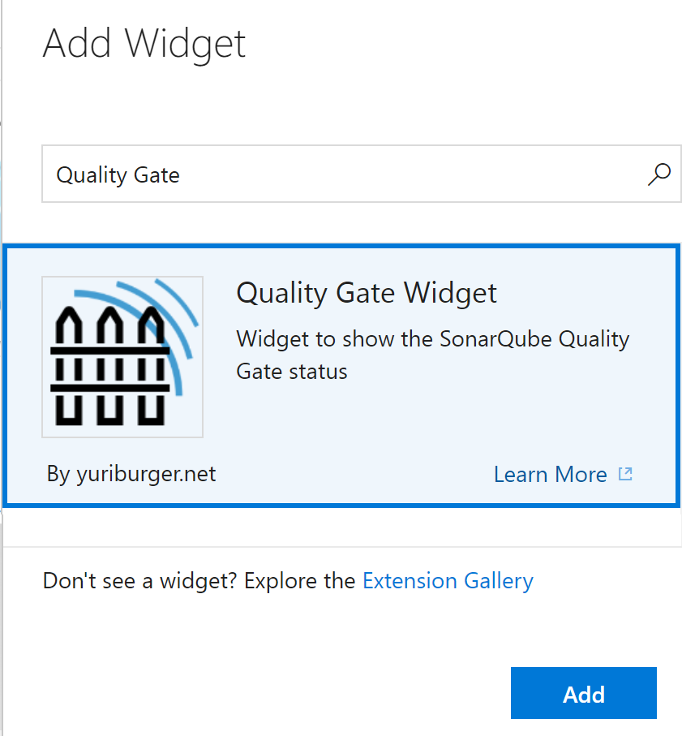

## Quality Gate Widget ##

Widget to show the SonarQube Quality Gate status for a project

### Quick steps to get started ###

1. Edit your dashboard
2. Select the Quality Gate Widget

3. Enter a title, a SonarQube project key and the URL for your SonarQube server

4. Add and arrange one or more of the widgets on your dashboard.

### Known issue(s)

- You need to provide the full url for your SonarQube Api. 
Example: https://localhost/api/qualitygates/project_status?projectKey=

### Learn More

The [source](https://github.com/yuriburger/quality-gate-widget) to this extension is available. Feel free to take, fork, and extend.

### Minimum supported environments ###

- Visual Studio Team Services

### Feedback ###
- Add a review here.
- File any issues on GitHub [issues](https://github.com/yuriburger/quality-gate-widget/issues).